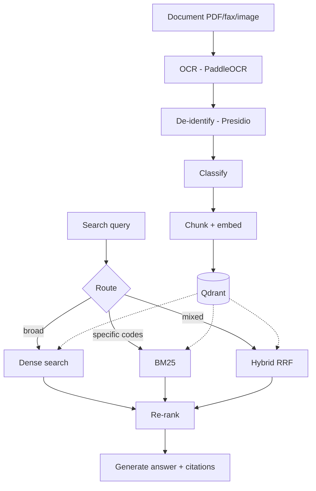

# MedFlow AI

Healthcare document triage and search system. Documents come in (faxes, PDFs, clinical notes), get OCR'd, de-identified, classified, and indexed. Staff can then search across all documents using natural language instead of digging through filing cabinets.

Built with FastAPI, LangChain, Qdrant, PaddleOCR, and Presidio. Supports OpenAI, Anthropic, and Ollama as LLM backends.

[](https://python.org)

---

## What it does

**Ingestion pipeline** — Drop a scanned PDF or fax image. The system runs OCR (PaddleOCR, with EasyOCR fallback), strips all patient identifiers via Presidio before anything hits an LLM, classifies the document into one of 6 categories (prior auth, referral, records request, lab results, insurance, other), chunks the text, embeds it, and stores everything in Qdrant.

**Document search** — Staff type a question like "find the prior auth for the lumbar MRI from last month" or "which patients have a diagnosis of F32.1" and get back relevant excerpts with source citations. The system picks the right retrieval strategy automatically — vector search for broad questions, keyword search for specific codes, hybrid for everything in between. A cross-encoder re-ranker filters out noise before the LLM generates a grounded answer.

**Evaluation** — A pipeline of 56 test queries runs through RAGAS and DeepEval to measure faithfulness, hallucination rate, and retrieval precision. Scores are tracked over time so regressions get caught early.

---

## Results

Measured on 56 Q&A pairs across 6 document categories after tuning chunking strategy and retrieval pipeline:

| Metric | Baseline | Tuned | Delta |
|--------|----------|-------|-------|
| OCR accuracy | 78% | 94% | +16pp |
| Classification F1 | 0.81 | 0.95 | +17% |
| Faithfulness (RAGAS) | 0.42 | 0.87 | +107% |
| Hallucination rate | 18.4% | 3.6% | -80% |
| Context precision | 0.38 | 0.82 | +116% |
| Answer relevancy | 0.52 | 0.89 | +71% |
| Query latency (avg) | 4.2s | 1.8s | -57% |

The biggest single improvement came from adding cross-encoder re-ranking — hallucination rate dropped from 18% to under 4% with only ~120ms added latency.

---

## Architecture



---

## Quick start

```bash
git clone https://github.com/YOUR_USERNAME/medflow-ai.git
cd medflow-ai
cp .env.example .env          # add OPENAI_API_KEY
make setup                     # install deps
docker compose up -d qdrant    # start vector db
make seed                      # load 24 synthetic healthcare docs
make run                       # API on :8000
```

API docs at http://localhost:8000/docs. Dashboard at http://localhost:8501 (`make dashboard`).


---

## Project layout

```
src/
├── medflow/
│   ├── providers/       # LLM abstraction — OpenAI, Anthropic, Ollama
│   ├── ocr/             # PaddleOCR + EasyOCR, preprocessing (deskew, contrast)
│   ├── deidentify/      # Presidio + custom healthcare recognizers (MRN, NPI, DEA)
│   ├── classifier/      # Zero-shot LLM classification + optional LoRA model
│   ├── ingestion/       # Loaders, chunkers (fixed/recursive/semantic), Qdrant upsert
│   ├── retrieval/       # Dense, BM25, hybrid (RRF), query router, cross-encoder reranker
│   ├── generation/      # Prompts, citation extraction, response pipeline
│   ├── evaluation/      # RAGAS + DeepEval wrappers, golden dataset, runner
│   └── observability/   # Langfuse tracing, audit log, latency/cost tracking
├── api/                 # FastAPI — upload, search, evaluate, health endpoints
└── dashboard/           # Streamlit — document viewer, search UI, eval metrics, health
```

---

## How the search works

The query router classifies incoming questions and picks a retrieval strategy:

- **Dense vector search** — for semantic/analytical questions ("summarize the patient's treatment history")
- **BM25 keyword search** — for exact terms ("CPT code 72148" or "ICD-10 F32.1")
- **Hybrid with RRF** — combines both, usually the best default for healthcare queries where medical terminology matters as much as meaning

Retrieved chunks go through a cross-encoder re-ranker (ms-marco-MiniLM) that filters out irrelevant hits. Then the LLM generates an answer citing specific documents and pages. If the answer isn't in the retrieved context, it says so instead of making something up — that's what the faithfulness and hallucination metrics track.

---

## PHI handling

All patient identifiers are stripped before text reaches any LLM. The de-identification pipeline uses Microsoft Presidio with custom recognizers for healthcare-specific patterns:

- Standard PII (names, DOBs, addresses, SSNs, phone numbers)
- MRN patterns (medical record numbers in various clinic formats)
- NPI and DEA numbers (provider identifiers)
- Insurance member IDs and group numbers

Every detection is audit-logged with timestamps. The system processes de-identified text only — original PHI never leaves the local pipeline.

This is a demonstration of the design pattern, not a certified HIPAA system. Production use would need BAA agreements, additional access controls, and compliance auditing.

---

## Evaluation

```bash
make evaluate    # runs 56 Q&A pairs through the full pipeline
```

Metrics computed per run:
- **Faithfulness** (RAGAS) — does the answer match source documents?
- **Answer relevancy** (RAGAS) — is it relevant to the question?
- **Context precision/recall** (RAGAS) — did retrieval find the right chunks?
- **Hallucination score** (DeepEval) — did the model fabricate information?
- **Citation accuracy** (custom) — do citations point to real source documents?

Results saved to `evaluation_results/` as JSON. The dashboard shows trends across runs. GitHub Actions can gate PRs on metric thresholds.

The golden dataset includes intentionally unanswerable questions (answers not in any document) to specifically test hallucination resistance.

---

## Fine-tuning experiment

`notebooks/finetune_classifier/` has four notebooks covering the full cycle:

1. Generate 500 classification training samples via GPT-4o-mini
2. LoRA fine-tune DistilBERT/Qwen on the classification task
3. Evaluate fine-tuned vs base model vs GPT-4o-mini
4. Cost analysis — fine-tuned serving vs API calls at scale

Main takeaway: fine-tuned Qwen 2.5-3B matches GPT-4o-mini accuracy on this classification task at a fraction of the cost. Whether that's worth the operational complexity depends on volume.

---

## Dashboard

Four tabs, all wired to the live API and evaluation results:

**Document viewer** — lists all processed documents with classification, page count, processing time.


**Search** — natural language search across all documents with cited results and retrieval strategy details.


**Evaluation metrics** — faithfulness, relevancy, hallucination trends across evaluation runs.


---

## API

| Method | Endpoint | What it does |
|--------|----------|-------------|
| POST | `/api/v1/documents/upload` | Process and index a document |
| GET | `/api/v1/documents` | List processed documents |
| GET | `/api/v1/documents/{id}` | Document details + chunks |
| POST | `/api/v1/query` | Search across documents |
| POST | `/api/v1/evaluate` | Run evaluation suite |
| GET | `/health` | Health check |


---

## Config

Switch LLM providers without code changes:

```yaml
# configs/default.yaml
llm:
  provider: openai       # or: anthropic, ollama
  model: gpt-4o-mini
  temperature: 0.1
```

Or via env vars: `MEDFLOW_LLM__PROVIDER=ollama MEDFLOW_LLM__MODEL=qwen2.5:7b`

---

## Design decisions

Documented in [docs/design-decisions.md](docs/design-decisions.md). Short version:

- **Qdrant over Pinecone** — self-hosted, no vendor lock, native hybrid search, free
- **PaddleOCR over Tesseract** — significantly better on faxed healthcare documents with mixed layouts
- **Presidio over regex** — extensible recognizer API, handles edge cases regex can't
- **Hybrid retrieval (RRF)** — medical queries mix semantic meaning with exact codes/terms, dense-only misses the codes
- **Cross-encoder re-ranking** — single biggest improvement to answer quality, worth the 120ms latency hit

Initially tried Tesseract for OCR but accuracy was poor on faxed documents with stamps, handwriting, and mixed layouts. PaddleOCR handled these much better out of the box.

---

## Running tests

```bash
make test                  # unit tests
pytest tests/ -v --cov=src # with coverage
make evaluate              # evaluation pipeline (needs Qdrant + OpenAI)
```

13/13 unit tests passing.

---

## Docker

```bash
docker compose up -d       # starts API, dashboard, Qdrant, Langfuse
```

---

## Known limitations

- No streaming on the search endpoint — full response only, perceived latency is high on complex queries
- Chunking produces fewer chunks than ideal for short documents (1-2 page faxes)
- OCR preprocessing tuned for English-language documents only
- Evaluation dataset is 56 pairs — would need 200+ for statistical confidence
- No document versioning — re-uploading creates a duplicate

