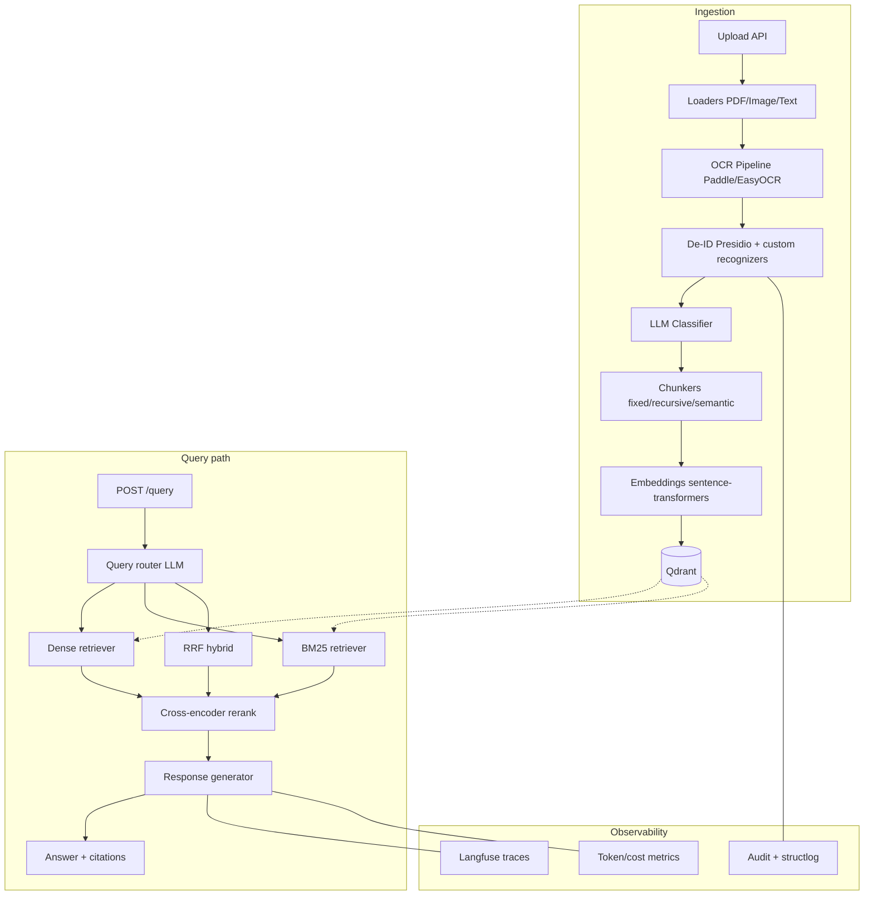

# Architecture

## Diagram

## Components

- **API (`src/api`)** — FastAPI application with ingestion, RAG query, evaluation trigger, health checks.
- **Core (`src/medflow`)** — OCR, de-identification, retrieval, generation, evaluation, and provider abstractions.
- **Dashboard (`src/dashboard`)** — Streamlit operational views for documents, QA, metrics, and health.
- **Data (`data/synthetic`)** — Synthetic corpus + golden Q&A for reproducible evaluation.
